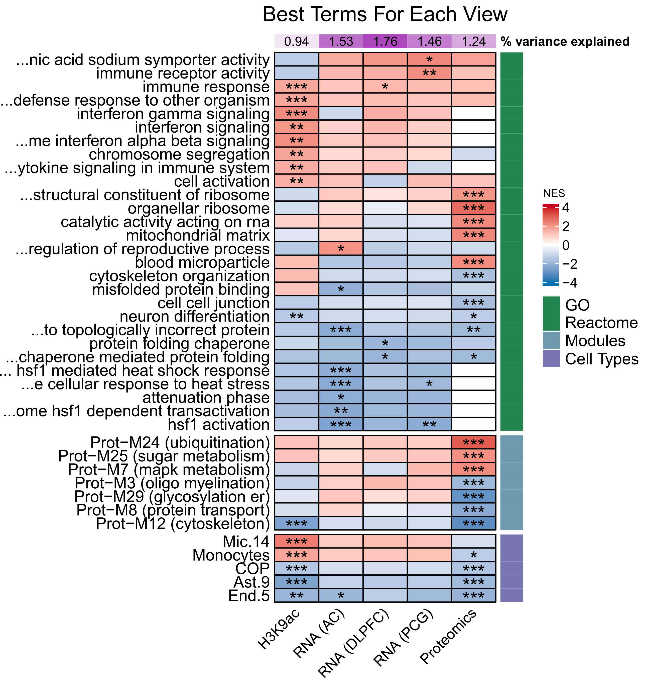

# **Gene Set Enrichment Analysis of MOFA factors**

#### The following files contain gene sets for H3K9ac acetylation, proteomics, metabolomics, and transcriptomics data; the code to perform GSEA; the code to visualize the best features for each data type; and the code to visualize factor enrichment characterization.

  

