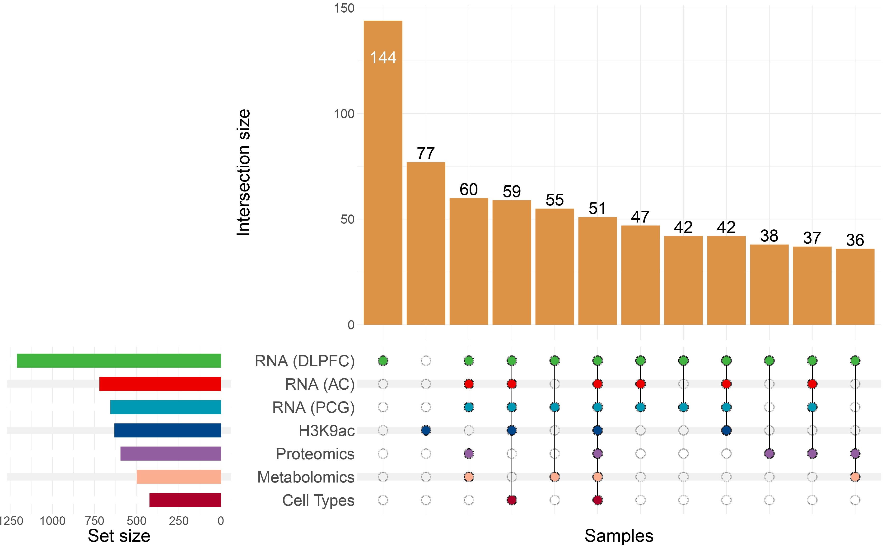

# **Manuscript code**

#### The following files contain:
- `Supplementary_tables.R` – contains all supplementary tables
- `UpSet_plot.R` – UpSet plot of  MOFA's samples
- `compare_loadings_factor2_and_factor3.R` – displays the comparision between factors 2 and 3

  

